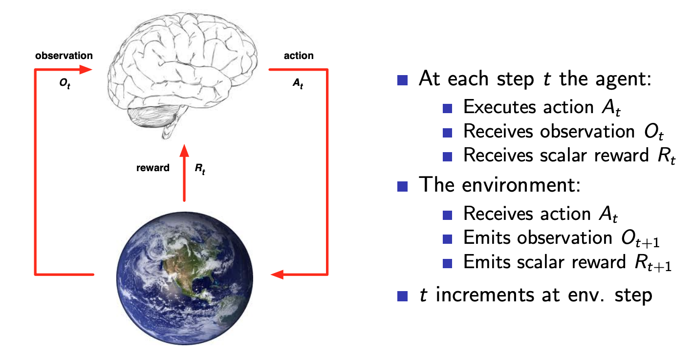
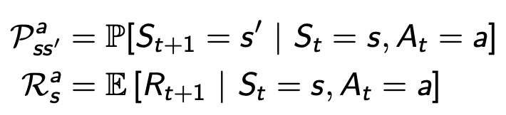

# Lecture 1: Intro to RL
## Overview
- RL lies at the intersection of fields like CS, neuroscience, engineering, math, psychology, and economics, which all have subfields concerned with finding the optimal way to make decisions and optimize utility (the core goal of RL)
- Within ML, distinct from supervised and unsupervised
    - No supervisor, just a reward signal
    - Feedback is delayed
    - Sequential—time matters because the agent is within dynamic system
        - The agent's actions affect the subsequent data it receives

## Maximizing rewards
- Reward Rt is a scalar feedback signal at each step t. The model's goal is to maximize cumulative reward
- RL is based on the reward hypothesis: all goals can be described by the maximisation of expected cumulative reward
- Sequential decision making: select actions to maximize total future reward
    - Rrequires balancing immediate and long-term rewards

## Agent and environment
Given an observation and reward signal from the environment, the agent takes action at each time step

## History and state
- History at time t is the sequence of observations, actions, rewards from timestep 1 to t. The agent selects actions based on this history, and the environment selects observations/rewards based on the history

- State is the info used to determine what happens next, a kind of summary that is a function of history: St = f(Ht)
    - Environment state Set is the environment's private representation
        - Not usually visible to the agent (which has limited observational ability)
    - Agent state Sat is the agent's internal representation (i.e. the info used to pick the next action or the info used by RL aglorithms). It can be any function of history, summarized into a useful form.
- **Markov property**
    - Markov state (aka information state) captures all useful info from the history
        - St is Markov iff the probability of St+1 given St = the probability of St+1 given S1...St.
        - In other words, the future is independent of the past given the present (Markov property). All relevant info is stored in the present state, so the history is relevant once the state is known.
    - There is always a Markov state: the environment state is Markov, and the full history is also Markov. The trick is getting something accessible (unlike the env state) and something more concise (unlike the full history).
    - There are many possible options for state, and choosing a "good" representation of history is necessary to make good predictions.

## Environment observability
- **Fully observable environments**: agent directly observes environment state, so Ot = Sat = Set. The Markov state is the same as the agent state and environment state. This is a Markov decision process (MDP)
- **Partially observable environments**: agent indirectly observes env (e.g. robot with camera vision), so agent state != environment state. POMDP. Must build Sat from Ht, and options could be: 
    - The complete history 
    - Agent's *beliefs* about environment state (Bayesian, probability distribution of where you are in the environment)
    - RNN that calculates a state from the agent state at the previous timestep: Sat = sigma(Sat-1*Ws+OtWo) where Ws are weights

## Inside An RL Agent
Components that may be inside a RL agent
- Policy: agent's behavior function, pi, which maps state to action
    - e.g. a = pi(s) would be a deterministic policy, pi(a|s) = probability[A = a|S = s]
    - learning it to maximize reward
- Value function: how good is each state and/or action 
    - prediction of expected future reward 
    - evaluating the goodness/badness of states to help select between actions
    - vpi(s) = Epi[Rt+gamma*Rt+1+gamma2*Rt+2 + ... | St=s]
        - Expectation of future reward, discounted, from some state onward from the given position
        - Allows us to compare different behavior options
- Model: agent's representation of the environment (optional--there are model free approaches)
    - Predicts what the env will do next
    - Transitions: P predicts the next state (i.e. dynamics)
    - Rewards: R predicts the next (immediate) reward

## Maze example
- See slides for diagrams
- Rewards: -1 per time step
- Actions: NESW
- States: agent location

- Policy: what action to do in each state
- Value: expected future reward for each location. Gives a basis to determine the policy (i.e. which of the 4 directions leads to the best value)
- Model: agent can create model of env in its "head" given its experiences of both the transitions (which would be the grid its explored so far) and the immediate rewards experienced from each state

## RL agent taxonomy
- Value-based
    - Contains a value function explicitly, so the policy is implicit (determined by value function)
    - See the slide with the values in each state, which the agent would explicitly store and determine its actions from
- Policy-based
    - Represent the policy explicitly, so the values are implicit
    - See the slide with the arrows in each state, which the agent would explicitly store and determine its actions from
- Actor critic stores both

- Model free: policy and/or value function, but no model. Don't try to understand the environment.
- Model based: policy and/or value function and no model

## Problems in RL
- 2 types of problems: RL (env unknown, agent interacts with env to improve policy) vs. planning (model of environment is known and agent improves policy by performing computations with its model instead of in the external world, plan by doing things like tree search)
- How to balance exploration and exploitation? 
    - Exploration: find new info about env
    - Exploitation: exploit known info the maximize reward
    - Agent should discover a good policy by exploring to find best policy without losing too much reward along the way.
- Prediction and control
    - prediction: how well will I do in the future, given a policy
    - control: optimise the future, find the best policy
    - need to evaluate/predict in order to optimise/control. The approaches are different.