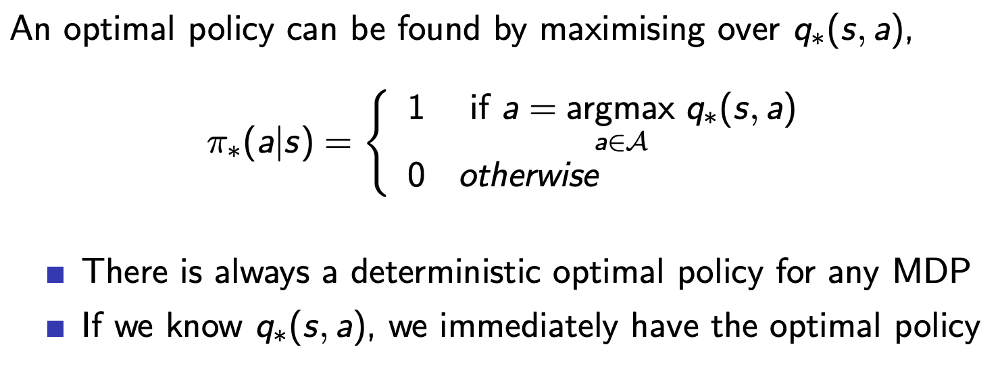
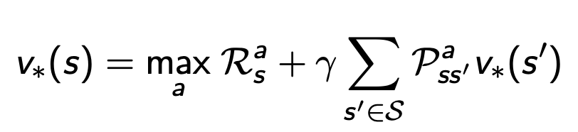
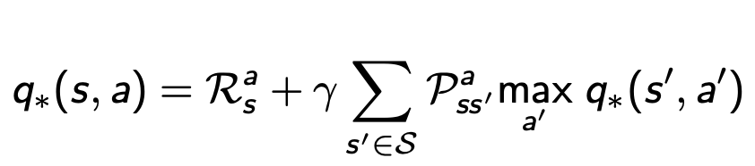

# Lecture 2: Markov Decision Process

## Markov Processes
- MDPs formally describe an environment for RL 
- A state is Markov if it fulfills the Markov property
- State transition matrix
    - State transition probability: Pss'=P[St+1=s' | St=s]
    - State transition matrix defines transition probabilities from all states s to all states s'. Each row sums to 1 (rows=s, cols=s').
- A **Markov process** is made up of a tuple (S, P), where S is a finite set of states and P is state transition probability matrix
    - A memoryless random process (a sequence of random states with the Markov property), sampled from the probability distribution's defined dynamics.
 

## Markov Reward Processes
Markov reward process is a Markov chain with value judgements, represented by (S,P,R,gamma)
- R is the reward that'll be derived from the current state s
- discount factor gamma ([0,1]) defines the present value of future rewards (determining how much to prefer immediate over future rewards)
- Return = Gt = sum of rewards over time, discounted so that recieving reward R after K=1 steps is gammakR (see slides for formula) (goal of RL is to maximize return)
    - Why discounting
        - future is uncertain and models are imperfect--can't always count on plans to work out and yield reward
        - avoids infinite returns
        - human behavior prefers immediate rewards as well
- Value function gives the expected cumulative reward (return) starting from state s
- The **Bellman equation** expresses the value function of a state in terms of the value of successive states (discounted, + current reward), creating a recursive relationship
    - Expressed in terms of backup diagrams
    - Can be concisely written in matrix form
    - Linear and solvable for v in O(n^3) 

## Markov Decision Processes
- (S, A, P, R, gamma)
    - adding a set of actions to the markov reward process definition
    - can flatten back into mp or mrp using a sum over actions, weighted by the probability determined by policy

- **policy** pi captures the probabilities of an action given a state (only the current state, not the history, because of the markov property )
- **state-value function** vpi(s) is the expected Gt starting from state s and following policy pi
- **action-value function** qpi(s) is the expected Gt starting from state s and action a and following policy pi afterwards
- new bellman eqs
    - can write v and q in terms of each other
    - 2 step backup diagram (s-->a-->s or a-->s-->a), composed of the v-->q q-->v diagrams or vibe versa

- **optimal value function**
    - the max v over all policies or the max q over all policies
    - can determine the optimal actions once q* is known (or v*, presuming that you know the transition dynamics and which action to take to reach the optimal best state)
- **optimal policy** has v >= v for all other policies 
    - can be more than 1 optimal policy, if they have the same optimal v* and q*
    - given by q*

- Bellman optimality equation for v*
    - instead of averaging across possible actions, take the action with max q*(s,a)
    
    
    - nonlinear, no closed form bc max. instead use iterative solution methods.

- principle of optimality: choosing greedily wrt to v* --> optimal policy
## Extensions to MDPs