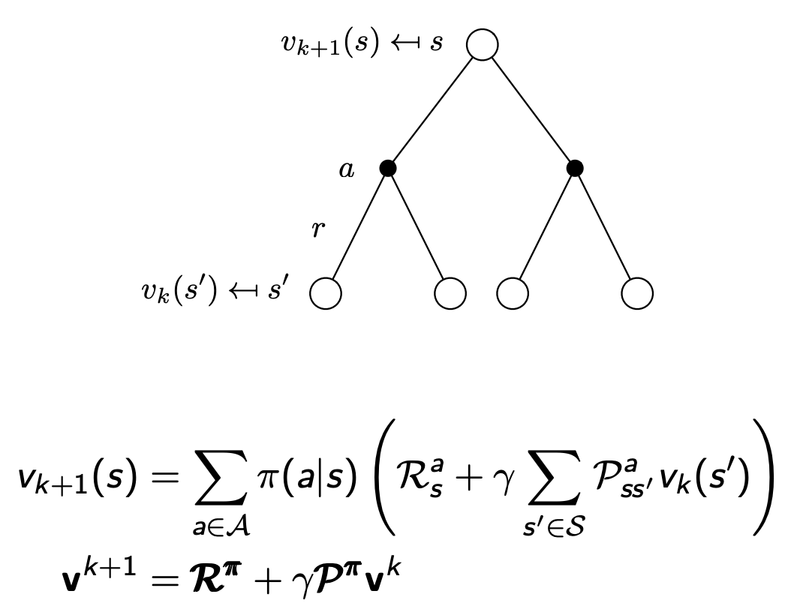
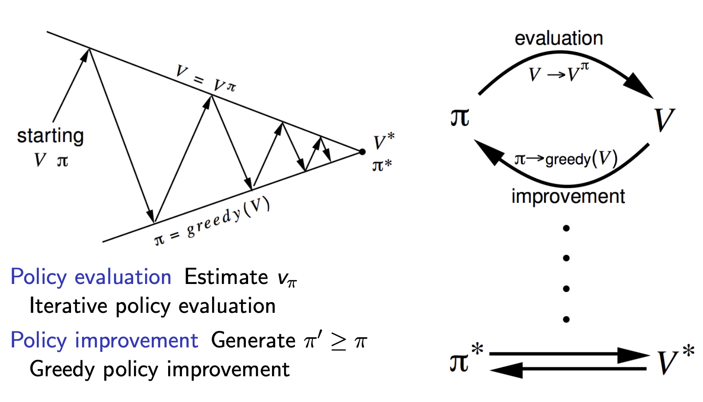
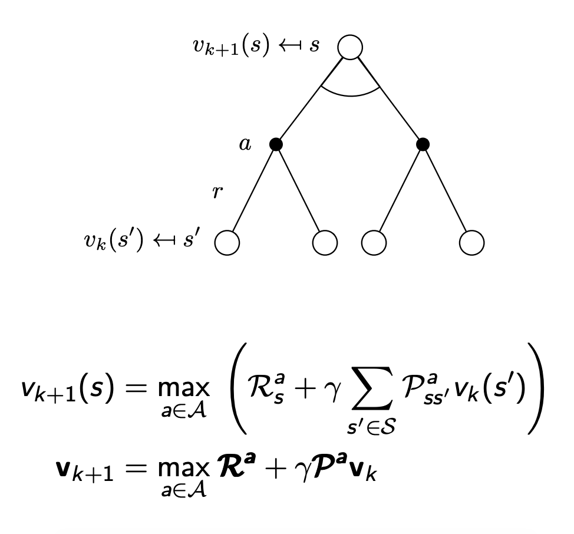
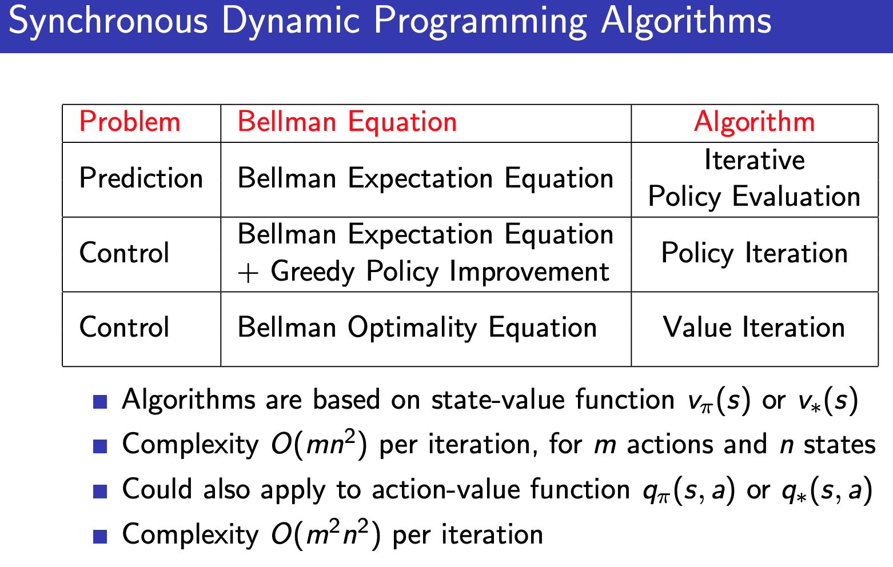

# Dynamic Programming

## Overview of DP (not RL)
- Informally: solve complex problems by breaking them down into subproblems, solving the subproblems, and putting them back together to get the solution
- Can solve problems with 2 properties
    - Optimal substructure
        - Optimal solution can be decomposed into subproblems
    - Overlapping subproblems
        - Subproblems recur many times
- MDPs satisfy both properties
    - Bellman equation has a recursive decomposition
    - Value function stores and reuses solutions (when encountering known states or actions)

- Possible tasks in the context of MDPs
    - DP assumes full knowledge of the MDP 
        - Planning problem rather than the RL problem bc MDP is known
    - For prediction: from MDP and policy, predict the value function
    - For control: from MDP, optimal value function (which leads to the optimal policy)
## Policy Evaluation
- Problem: evaluate a given policy
- Solution: iterative application of Bellman expectation backup
    - Create an initial value function v1 of all 0s and update it many times (by applying a 1 step look ahead) to reach the true vpi
    - More formally, 
        - (The values from the leaves define the new values of the nodes)
        - Basically the Bellman expectation equation, except vk+1 is being updated by vk

## Policy Iteration
- Given a policy
    - Evaluate the policy to obtain vpi
    - Improve the policy by acting greedily WRT vpi to obtain pi'
    - Many iterations of eval/improvement = policy iteration, which always converges to pi*

- More formally:
    - Deterministic policy a = pi(s)
    - Improve the policy by acting greedily WRT vpi. pi'(s) = argmax qpi(s, a) = the action with the greatest value. This improves the value from any state s over one step (or matches it if the previous policy is already ideal for that step)
    - if improvements stop, then bellman optimality eq has been satisfied bc vpi(s) = max a for qpi(s,a). v = v*   

- Modified policy iteration
    - stop early and don't do unnecessary work by evaluating v k times and then improving pi once, then repeat
    - basically, you don't need to wait for vpi to converge all the time before moving onto the greedy bit
    - when you only sweep v once (rather than waiting for it to converge) before being greedy, that's value iteration (see the textbook for more details)
        - value iteration combines policy eval and policy improvement because it has the max function built in (already greedy over the next actions)

## Value Iteration
Optimal policy can be subdivided into components
- An optimal first action A*
- Followed by an optimal policy from state s'
- Formalized in the principle of optimality
    - A policy achieves the optimal value from state s (v*(s)) iff for any state s' reached by pi, pi achieves the optimal value from state s' (v*(s'))

Overview
- If we know the solution to subproblems v*(s')
- One step lookahead to look at the leaves and go up the tree
- Intuition: start with final rewards and work backward
    - But really, you are updating every state at all steps

Formally, to find optimal policy pi
- use iterative application of Bellman optimality backup to update vk+1(s) from vk(s')
- Bellman optimality eq except with vk to update vk+1

- Note: there is no explicit policy, and it doesn't build a policy for every intermediate v

## Overview

- Modified is in between policy iter and value iter
## Extensions
Asynchronous DP allows greater efficiency by taking advantage of the fact that you can update states in any order

- in place methods
    - don't maintain separate v new and v old, instead just maintain v that you update in place
    - this way, you don't need however many sweeps to update all states. If things are in the right order, things could 'cascade' and you could find the optimal v in 1 sweep (because you update v based on v, so changes from last state considered can affect the next step or state considered immediately)
- prioritized sweeping
    - prioritize states based on how much v(s) is changing after updates
- real time dynamic programming
    - use only states relevant to the agent
- sampling
    - instead of exploring the whole tree, sample an action and sample an s' (this way you also dont have to know the dynamics of env--model free)
## Contraction Mapping